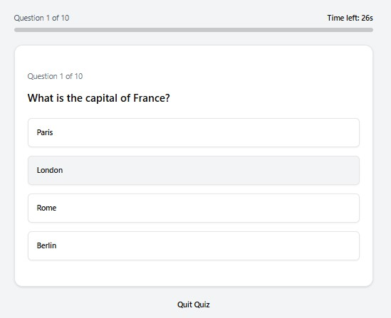

# 🚀 Quiz App

A **timed, interactive quiz application** built with modern web technologies.
It fetches real-time questions from QuizAPI.io via a **secure server-side proxy**, ensuring your API key is never exposed to the client.

👉 **Live Demo:** [https://quiz-app-ten-swart.vercel.app/](https://quiz-app-ten-swart.vercel.app/)


---

## ✨ Highlights

- ⏱️ **Timed Questions** — 30-second countdown with automatic progression
- 📊 **Progress Tracking** — Real-time progress bar
- ⚡ **Instant Feedback** — Correct/incorrect responses via toast notifications
- 🏆 **Performance Summary** — Personalized result based on score
- 🌐 **Offline Fallback** — Seamless experience even if API fails
- 🔐 **Secure API Proxy** — API key never exposed to frontend
- 📱 **Fully Responsive** — Optimized for all screen sizes

---

## 🧠 How It Works

```
Browser → /api/questions → Proxy (Express/Vercel) → QuizAPI.io
```

- **Development**
  - Vite proxies `/api` → local Express server

- **Production**
  - Vercel routes `/api/questions` → serverless function

- API key stays **100% secure on server**

---

## 🛠 Tech Stack

### Frontend

- ⚛️ React (Vite)
- 🎨 Tailwind CSS + shadcn/ui
- 🔀 React Router
- 🔔 Sonner (toast notifications)
- 🎯 Lucide React (icons)

### Backend / API

- 🌍 QuizAPI.io
- 🧩 Express (local proxy)
- ⚡ Vercel Serverless Functions

### Deployment

- ▲ Vercel

---

## 📂 Project Structure

```
quiz-app/
├── api/
│   └── questions.js          # Serverless API proxy
├── src/
│   ├── components/
│   │   ├── Home.jsx
│   │   ├── QuestionPage.jsx
│   │   ├── QuizCard.jsx
│   │   └── ui/
│   └── data/
│       ├── quizData.js
│       └── fallbackQuestions.js
├── server.js                # Express proxy (dev only)
├── vite.config.js
├── vercel.json
└── .env.local
```

---

## ⚙️ Getting Started

### Prerequisites

- Node.js (v18+)
- npm
- API key from QuizAPI.io

---

### 🔧 Installation

```bash
git clone https://github.com/theuzair/quiz-app.git
cd quiz-app
npm install
```

---

### 🔐 Environment Variables

Create `.env.local`:

```env
QUIZ_API_KEY=your_api_key_here
```

⚠️ Do NOT use `VITE_` prefix — this must stay server-side.

---

### ▶️ Run Locally

```bash
npm run dev
```

- Frontend → [http://localhost:5173](http://localhost:5173)
- Proxy → [http://localhost:3001](http://localhost:3001)

---

### 📦 Build

```bash
npm run build
```

---

## 🚀 Deployment

Deploy instantly using:

```bash
npx vercel --prod
```

Then add environment variable:

```bash
npx vercel env add QUIZ_API_KEY production
```

---

## 🎮 Usage

1. Click **Start Quiz**
2. Answer within **30 seconds**
3. Get **instant feedback**
4. View **final score & analysis**
5. Restart anytime 🔁

---

## ⚡ Advanced Features

### ⏳ Timeout System

- Automatically advances if no answer selected
- Prevents quiz blocking

### 🔄 Fallback System

- If API fails → loads local questions
- Ensures uninterrupted UX

### 🔐 API Security

- No API key exposure in frontend
- Serverless proxy handles all requests

---

## 📸 Screenshots

### Question View



---

## 🤝 Contributing

Contributions are welcome!

```bash
# Fork repo
git checkout -b feature-name
git commit -m "Add feature"
git push origin feature-name
```

Then open a Pull Request 🚀

---

## 📄 License

This project is licensed under the [MIT License](LICENSE) — free to use and modify.

---

## 💡 Future Improvements

- 🎯 Category & difficulty filters
- 🧠 Leaderboard system
- 📊 Analytics dashboard
- 🌍 Multi-language support
- 👤 User authentication

---

## 👨‍💻 Author

**Uzair**
Full Stack Developer (MERN + DevOps in progress)

---

## ⭐ Support

If you found this project helpful, consider giving it a ⭐ on GitHub!

---
